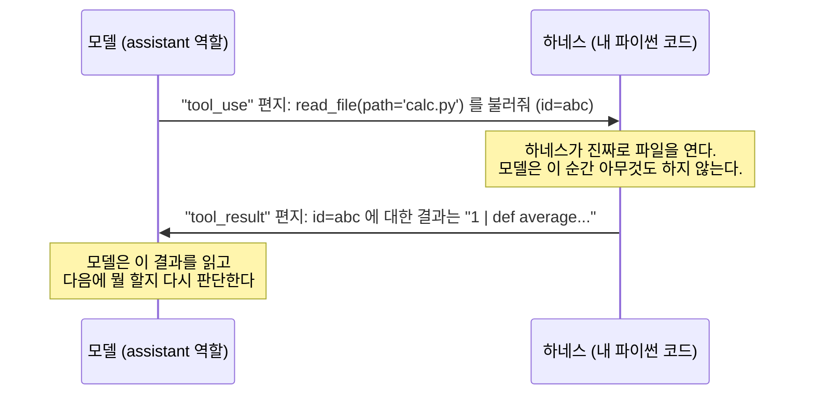
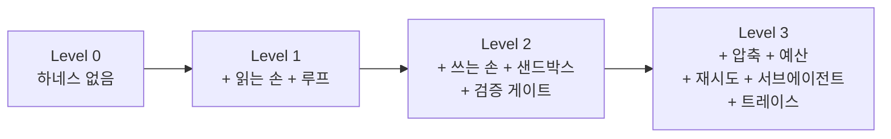
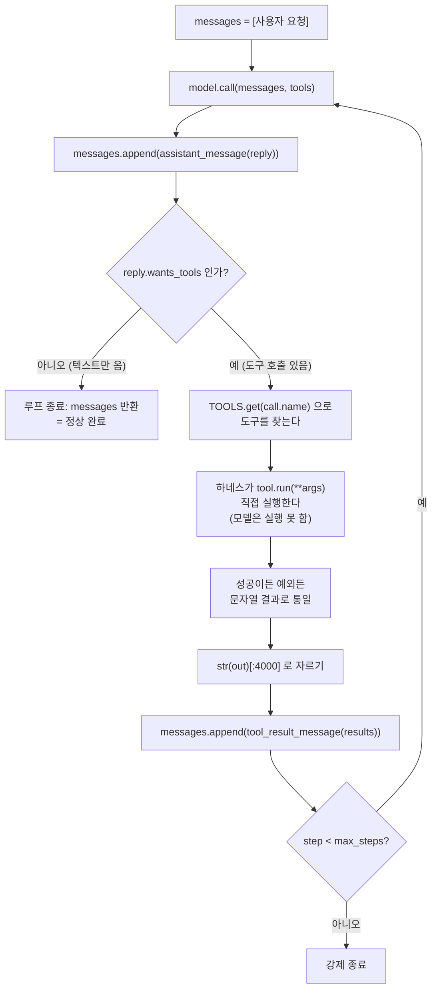
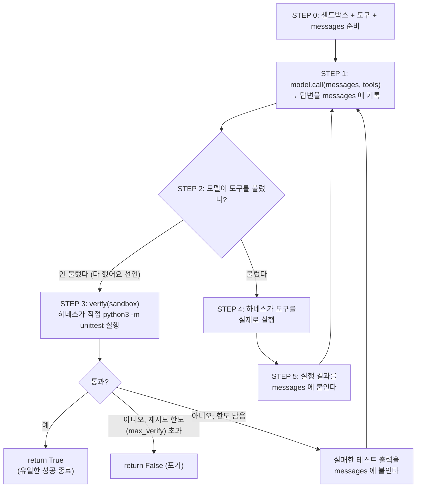
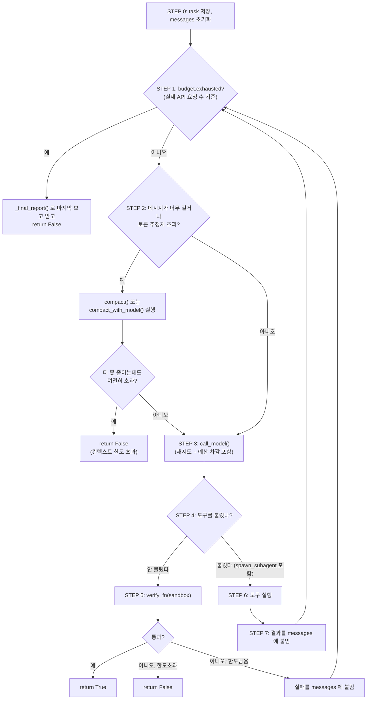
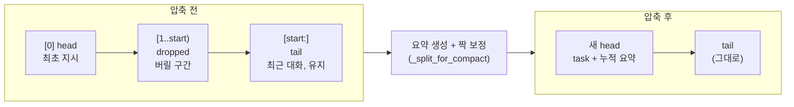

# mini-harness 학습 노트 — AI 에이전트 하네스, 처음부터 끝까지

> 이 문서는 `README.md`의 요약본이 아닙니다. AI 에이전트라는 말을 오늘 처음 듣는 사람 기준으로,
> 개념부터 실제 코드까지 순서대로 다시 짠 학습 자료입니다.

---

## 0. 이 문서에 대하여

**대상 독자**: AI 에이전트 · 하네스라는 개념을 완전히 처음 접하는 사람. 리눅스/터미널 명령어를 몰라도 됩니다(`grep`이 뭔지 몰라도 됩니다). 파이썬은 변수·함수·`if`/`for`·`dict`/`list`·`try`/`except` 정도의 기본 문법만 안다고 가정합니다. `@dataclass`, `@property`, 리스트 컴프리헨션 같은 조금 더 고급 문법은 나올 때마다 그 자리에서 짧게 풀어 설명합니다.

**선수지식**: 이것만 있으면 충분합니다.
- 파이썬 기본 문법 (함수 정의, `if`/`for`/`while`, `dict`/`list`, `try`/`except`)
- "함수는 입력을 받아 출력을 낸다"는 정도의 감각

**기준**: 이 문서의 모든 코드 인용은 `/Users/andreia4/Projects/harness/mini-harness/` 안의 **실제 파일을 직접 읽고** 그대로 옮긴 것입니다. `파일명:줄번호` 형식으로 위치를 표시했으니, 궁금하면 그 파일을 열어 직접 대조해보세요. 이 레포는 README보다 코드가 최신이므로(오늘 학습자가 직접 수정했습니다), **코드를 기준**으로 썼습니다.

**권장 순서**: 1부(개념)를 먼저 읽고, 2부에서 레벨 0→1→2→3 순서로 코드를 직접 열어보며 따라갑니다. 각 레벨을 읽을 때 실제로 터미널(명령어를 입력하는 검은 화면 프로그램)에서 `python3 level1_loop.py` 처럼 실행해보면 훨씬 잘 이해됩니다.

---

## TL;DR

- **모델(LLM) 자체는 텍스트만 주고받는 함수**입니다. 파일을 못 읽고, 이전 대화를 기억 못 하고, 한 번에 한 발짝만 걷습니다.
- **하네스**는 이 세 가지 결핍을 메우는 코드 뭉치입니다. 도구(손), 대화 기록 재전송(기억), 반복 루프(여러 발짝)가 핵심입니다.
- 실제로 하네스가 자주 망가지는 지점은 딱 하나, **"대화 기록을 API가 허용하는 모양으로 유지하기"**입니다. 이걸 못 지키면 400 에러가 납니다.
- 모델이 "다 했습니다"라고 말해도 믿지 않고 **직접 테스트를 돌려 확인하는 것**이 챗봇과 에이전트의 결정적 차이입니다.

---

# 1부. 개념 이해하기 (코드 없이)

## 1. 하네스란 무엇인가

**모델은 자동차 엔진이고, 하네스는 엔진을 뺀 자동차의 나머지 전부입니다.**

엔진만 있으면 시동은 걸리지만 어디로도 못 갑니다. 바퀴, 핸들, 브레이크, 연료탱크가 붙어야 "이동"이라는 실제 일이 됩니다. AI 모델(ChatGPT나 Claude 같은 LLM)도 마찬가지입니다. 모델 자체는 놀랍도록 똑똑한 텍스트 생성기이지만, 그것만으로는 파일 하나 못 고칩니다. 모델을 감싸서 실제 작업이 가능하도록 만드는 코드 뭉치 전체를 **하네스(harness)**라고 부릅니다.

> "하네스"라는 단어는 원래 말(馬)에 채우는 마구(馬具)를 뜻합니다. 말은 힘만 세고, 마구를 채워야 수레를 끌 수 있죠. 소프트웨어에서는 오래전부터 **테스트 하네스**라는 말을 써왔습니다 — 함수 하나를 테스트하려면 입력을 만들어 넣고, 가짜 데이터베이스를 붙이고, 결과를 정답과 비교하는 틀이 필요합니다. AI 하네스는 같은 개념을 모델에 적용한 것입니다.

정의를 한 줄로 정리하면:

> **하네스 = 모델을 "말만 하는 것"에서 "일하는 것"으로 바꿔주는 코드 인프라.**

## 2. 모델의 세 가지 결핍

API(프로그램끼리 데이터를 주고받는 통로라고 이해하면 충분합니다)를 통해 모델을 직접 불러보면, 모델은 이렇게 단순합니다.

```
텍스트를 넣으면 → 텍스트가 나온다. 끝.
```

여기에 결정적인 결핍이 셋 있습니다.

### 결핍 1: 손이 없다

모델은 파일을 읽을 수도, 명령을 실행할 수도, 인터넷을 볼 수도 없습니다. "이 프로젝트 코드 좀 봐줘"라고 하면, 모델은 파일을 볼 방법이 없으니 **그럴듯한 내용을 상상해서 지어냅니다.** 거짓말을 하려는 게 아니라, 그것 말고는 할 수 있는 게 없어서입니다. 이런 현상을 **환각(hallucination)**이라고 부르는데, 그중 상당수는 실은 "손이 없어서 생기는 일"입니다.

### 결핍 2: 기억이 없다

API 호출 한 번 한 번은 완전한 백지 상태에서 시작합니다. 방금 무슨 대화를 나눴는지는 매번 통째로 다시 넣어줘야 압니다. 챗봇과 대화가 이어지는 것처럼 느껴지는 이유는, **누군가가 뒤에서 지금까지의 대화 전체를 매번 다시 밀어넣고 있기 때문**입니다. 그 "누군가"가 바로 하네스입니다.

### 결핍 3: 한 발짝만 걷는다

"일단 이걸 해보고, 결과를 보고 다음을 결정하자"를 모델 스스로는 못 합니다. 호출 한 번에 응답 한 번, 그리고 끝입니다.

**하네스는 이 세 결핍을 메우는 배관 공사입니다.** 손 = 도구(tool), 기억 = 대화 기록 관리, 여러 발짝 = 반복 루프.

<details>
<summary>🧠 잠깐, 스스로 답해보기: "환각(hallucination)"의 상당 부분이 왜 '손이 없어서' 생긴다고 했을까요?</summary>

모델이 파일이나 실제 데이터를 볼 방법이 없는데 "이 코드에 뭐가 있냐"는 질문을 받으면, 확인할 방법이 없으니 학습 데이터에서 본 것과 비슷한 그럴듯한 내용을 만들어 답합니다. 이건 거짓말이 아니라 "볼 수 있는 도구가 없는 상태에서 최선을 다한 추측"입니다. 도구(읽는 손)를 주면 이 문제의 상당 부분이 사라집니다.
</details>

## 3. 핵심 추상화: "모델은 함수다"

코드를 보기 전에 딱 하나만 짚고 갑니다. 이 레포는 모델을 이렇게 정의합니다 (`model.py:106`).

```python
model.call(messages, tools, system=None) -> Reply(text, tool_calls, raw_content, usage)
```

풀어 말하면: **"지금까지의 대화 목록"과 "쓸 수 있는 도구 목록"을 넣으면, "텍스트"와 "부르고 싶은 도구 목록"이 나오는 함수**입니다. 이 인터페이스만 고정해두면, 그 뒤에 진짜 API가 있든 스크립트로 짜놓은 가짜가 있든 하네스 코드는 한 줄도 안 바뀝니다. 실제로 `model.py`에는 두 가지 구현이 있습니다.

```python
class FakeModel:      # 정해진 각본대로 답을 뱉는 가짜 → API 키 없이 배관만 검증
class AnthropicModel: # 진짜 API를 부르는 어댑터
```

(`model.py:55`, `model.py:89`)

이게 이 레포 전체의 첫 번째 설계 교훈입니다. 모델 호출 코드를 여기저기 직접 박아넣으면 테스트가 불가능해집니다. 이렇게 어댑터 하나로 감싸두면, `FakeModel`이라는 가짜로 "하네스가 도구를 제대로 실행하고 결과를 제대로 돌려주는지"만 따로, API 비용 없이 검증할 수 있습니다. 3부에서 다룰 `validate.py`가 통째로 이 설계 덕분에 존재합니다.

모델이 뱉는 두 가지 결과물을 데이터클래스로 정의해둔 것도 봅시다.

```python
@dataclass
class ToolCall:
    id: str          # 결과를 돌려줄 때 짝을 맞추는 식별자
    name: str        # 부르려는 도구 이름
    args: dict       # 인자(파라미터)
```
(`model.py:25-29`)

> **잠깐 문법 설명 — `@dataclass`란?**
> 클래스 위에 붙는 `@dataclass`는 "데코레이터"라고 부르는 파이썬 문법입니다. 원래는 `__init__`을 직접 써서 `self.id = id` 같은 코드를 반복해야 하는데, `@dataclass`를 붙이면 필드 목록(`id: str`, `name: str`, `args: dict`)만 적어도 파이썬이 알아서 생성자를 만들어줍니다. `ToolCall("c1", "read_file", {"path": "a.py"})`처럼 바로 만들 수 있게 되는 게 이 데코레이터의 효과입니다.

`ToolCall`은 "모델이 무슨 도구를 어떤 인자로 부르고 싶어하는지"를 담는 그릇일 뿐입니다. **모델은 여기서 끝** — 실제로 그 도구를 실행하는 건 언제나 하네스입니다. 이 문장이 2부 전체를 관통하는 핵심입니다.

### 참고: 모델 이름 (2026년 8월 기준)

이 레포의 기본 모델은 `model.py:19`의 `DEFAULT_MODEL = "claude-sonnet-5"`입니다. Claude 4.6 세대부터 모델 ID가 날짜 없는 고정 스냅샷 형식(예: `claude-sonnet-5`)으로 바뀌었고, `-latest` 같은 포인터가 아니라 그 자체가 특정 버전을 가리킵니다. 버전 이름은 계속 바뀔 수 있으니 정확한 최신 목록이 필요하면 Anthropic 공식 문서를 확인하세요.

## 4. ★ 대화 히스토리 불변식 — 이 레포 버그의 절반이 여기서 나온다

이번 장이 1부에서 가장 중요합니다. 오늘 이 레포를 실습하며 만난 버그가 전부 이 규칙들과 관련이 있었습니다.

### 4.1 먼저, "도구를 부른다"는 게 실제로 뭘 의미하는지

모델은 "코드를 직접 실행"하지 못합니다. 할 수 있는 건 **"이 도구를 이 인자로 불러줘"라는 구조화된 요청을 텍스트 대신 내놓는 것**뿐입니다. 이 요청을 `tool_use` 블록이라고 부릅니다. 하네스는 그 요청을 보고 실제로 함수를 실행한 뒤, 결과를 `tool_result` 블록으로 만들어 다시 모델에게 보여줍니다.

이걸 편지 교환으로 생각하면 쉽습니다.



여기서 편지에는 **반드시 발신인 역할(role)**이 적혀 있습니다. `tool_use`는 모델(`assistant`)이 보낸 편지이고, `tool_result`는 **하네스가 보낸 편지인데도 role은 `user`로 표시**됩니다(`model.py:171`). 왜냐하면 모델 입장에서 도구 결과는 "외부에서 새로 들어온 정보"이기 때문입니다. **이 사실을 놓치면 아래 규칙 5에서 바로 문제가 생깁니다.**

### 4.2 규칙 1: `tool_use`는 반드시 바로 다음 편지에서 `tool_result`로 답장받아야 한다

```python
{"role": "assistant", "content": [{"type": "tool_use", "id": "abc", ...}]}
{"role": "user",      "content": [{"type": "tool_result", "tool_use_id": "abc", "content": "..."}]}
```

`id`가 하나라도 짝을 못 찾으면 실제 API는 요청 자체를 거절합니다("400 오류"라고 부릅니다 — HTTP에서 "네 요청이 잘못됐다"는 뜻의 상태 코드입니다). **이게 코딩 에이전트에서 가장 흔하게 보고되는 오류 중 하나**입니다.

이 규칙을 실제로 검사하는 코드가 `validate.py`에 있습니다.

```python
for i, m in enumerate(messages):
    ids = {b["id"] for b in blocks(m, "tool_use")}
    nxt = messages[i + 1] if i + 1 < len(messages) else {}
    answered = {b["tool_use_id"] for b in blocks(nxt, "tool_result")}
    if ids - answered:
        check(False, f"{label}: 응답 없는 tool_use {ids - answered} (idx {i})")
```
(`validate.py:58-66`)

> **함정**: 대화가 길어져서 중간을 잘라내는 "압축(compaction)"을 할 때 이 짝이 갈라지기 쉽습니다. 뒤에서 N개만 남기고 앞을 버리는 식으로 자르면, N에 따라 잘린 시작점이 `tool_result`로 시작할 수 있는데 — 그 짝인 `tool_use`는 방금 버린 쪽에 있는 것이죠. **압축은 반드시 "짝 단위"로 잘라야 합니다.** 이 문제는 2부 Level 3에서 깊이 다룹니다.

### 4.3 규칙 2: 빈 내용(content)은 거절된다

`{"role": "assistant", "content": []}`처럼 아무 내용도 없는 편지나, `tool_result`의 `content`가 빈 문자열 `""`인 경우 API는 "내용이 비어있다"며 거절합니다. 이게 실제로 생기는 경로 두 가지:

1. 모델이 텍스트도 도구 호출도 없는 턴을 내놓는다 → 재조립하면 `content: []`
2. 도구가 빈 파일을 읽는다 → 결과가 `""`

그래서 이 레포는 두 곳 모두에 안전장치(폴백)를 넣어뒀습니다.

```python
if not content:
    # 빈 content 리스트는 API가 거절한다("non-empty content").
    content.append({"type": "text", "text": "(내용 없음)"})
```
(`model.py:161-164`)

```python
content.append({
    "type": "tool_result",
    "tool_use_id": tid,
    "content": out if out else "(출력 없음)",   # 빈 문자열도 거절 대상
    ...
})
```
(`model.py:181-186`)

`tools.py`의 `_read_file`도 같은 이유로 빈 파일을 읽으면 `"(빈 파일)"`을 돌려줍니다(`tools.py:110-112`).

### 4.4 규칙 3: 모델의 응답은 파싱하지 말고 그대로 되돌려 넣어라

공식 패턴은 이렇습니다.

```python
messages.append({"role": "assistant", "content": response.content})   # ← 원본 그대로
```

왜 원본을 그대로 써야 할까요? 파싱해서 내가 다시 조립하면 두 가지가 깨질 수 있습니다.

- 텍스트와 도구 호출이 섞인 순서(`text → tool_use → text`)가 뭉개질 수 있음
- 모델이 "생각 과정"을 보여주는 기능(extended thinking)을 쓰는 경우, 그 내용과 서명(signature)을 빼먹으면 다음 턴에서 오류가 남

그래서 `model.py`의 `Reply`는 `raw_content`라는 필드로 API 응답 원본을 그대로 들고 있고, `assistant_message()`는 이게 있으면 무조건 그걸 그대로 씁니다.

```python
if reply.raw_content is not None:
    return {"role": "assistant", "content": reply.raw_content}

# 가짜 모델용 폴백: Reply 로부터 블록을 재구성
content = []
if reply.text:
    content.append({"type": "text", "text": reply.text})
for c in reply.tool_calls:
    content.append({"type": "tool_use", "id": c.id, "name": c.name, "input": c.args})
```
(`model.py:152-160`)

재조립 폴백은 오직 `FakeModel`(원본 응답이 없는 가짜)을 쓸 때만 동작합니다. 진짜 API를 쓸 때는 항상 원본이 그대로 갑니다.

### 4.5 규칙 4: 비어 있는 파라미터는 아예 보내지 마라

`system=""`나 `tools=[]`처럼 "존재는 하지만 비어있는" 값은 아예 보내지 않는 편이 안전합니다. `AnthropicModel.call()`이 요청을 만들 때 이렇게 조건부로 조립하는 이유입니다.

```python
kwargs = {"model": self.model, "max_tokens": self.max_tokens, "messages": messages}
sys_prompt = system if system is not None else self.system
if sys_prompt:
    kwargs["system"] = sys_prompt
if tools:
    kwargs["tools"] = [t.schema for t in tools]
```
(`model.py:109-118`)

### 4.6 규칙 5: 첫 메시지는 user, 같은 역할이 연속되면 안 된다

여기가 학습자들이 가장 자주 헷갈리는 지점입니다. **도구 결과(tool_result)의 role이 `user`라는 걸 규칙 1에서 봤죠.** 그런데 압축(요약)을 만들 때 그 요약을 "새로운 지시"처럼 별도 `user` 메시지로 끼워넣으면 어떻게 될까요?

```
... (도구 결과, role=user)
(요약, role=user)    ← 방금 것과 role이 똑같다!
```

이렇게 `user` 역할이 연속되는 모양이 생깁니다. 직접 API를 호출하면 관대하게 병합해줄 수도 있지만, 엄격한 검증기나 일부 프록시는 이걸 거절합니다. 그래서 이 레포는 **요약을 별도 메시지로 추가하지 않고, 최초 지시 메시지 "안에" 접어 넣습니다.** (2부 Level 3의 `compact()`에서 자세히 봅니다.)

`validate.py`는 이 규칙도 기계적으로 검사합니다.

```python
for i in range(1, len(messages)):
    if messages[i].get("role") == messages[i - 1].get("role"):
        check(False, f"{label}: 연속 {messages[i]['role']} 턴 (idx {i})")
```
(`validate.py:80-83`)

### 4.7 다섯 규칙 요약표

| # | 규칙 | 어기면 | 코드 근거 |
|---|------|--------|-----------|
| 1 | `tool_use`는 바로 다음 메시지에서 `tool_result`로 답해야 함 | 400 오류 | `model.py:174-177`, `validate.py:58-66` |
| 2 | 빈 content/빈 tool_result는 거절됨 | 400 오류 | `model.py:161-164`, `184-186` |
| 3 | 모델 응답은 원본(`raw_content`) 그대로 되돌려 넣기 | 순서/사고과정 유실 → 다음 턴 400 | `model.py:141-165` |
| 4 | 빈 파라미터(`system=""`, `tools=[]`)는 아예 보내지 않기 | 스키마 위반 가능성 | `model.py:109-118` |
| 5 | 같은 역할(role) 연속 금지, 첫 메시지는 `user` | 프록시/엄격한 검증기에서 거절 | `validate.py:43-44`, `80-83` |

<details>
<summary>🧠 잠깐, 스스로 답해보기: 도구 결과(tool_result)의 role이 왜 "assistant"가 아니라 "user"일까요?</summary>

도구를 부른 주체는 모델(assistant)이지만, 그 결과(파일 내용, 명령 실행 결과 등)는 모델이 만든 게 아니라 **외부 세계에서 새로 들어온 정보**이기 때문입니다. 모델 입장에서 보면 "네가 요청한 걸 실행했더니 이런 결과가 나왔어"라는, 대화 상대방(=user 쪽)이 알려주는 새로운 사실인 셈입니다. 이 역할 배정이 규칙 5의 함정(user 연속)을 만드는 근본 원인이기도 합니다.
</details>

---

# 2부. 레벨별로 코드 읽기

이제부터는 실제 `.py` 파일을 열어가며 읽습니다. 각 레벨은 "이전 레벨에 뭘 더했는가"로 이해하는 게 가장 빠릅니다.



## Level 0 — 하네스 없음

파일: `level0_bare.py`

이 레벨은 모델을 정말 딱 한 번만 부릅니다.

```python
reply = model.call([{"role": "user", "content": TASK}], tools=[])
```
(`level0_bare.py:37`)

`tools=[]`는 "쓸 수 있는 도구가 하나도 없다"는 뜻입니다. `TASK`는 `level0_bare.py:20`에 정의된 문자열 `"demo_project 의 테스트가 실패한다. 원인을 찾아서 고쳐줘."`입니다.

실행하면(`python3 level0_bare.py`) 모델은 이런 식으로 답합니다.

```
테스트 실패의 흔한 원인은 다음과 같습니다:
1. ZeroDivisionError — 0으로 나누는 경우
2. import 경로 문제
3. 부동소수점 비교 오차
코드를 붙여주시면 더 정확히 봐드릴 수 있습니다.
```
(`level0_bare.py:28-34`의 가짜 모델 각본)

**관찰**: 답변이 틀린 건 아닙니다. 오히려 그럴듯합니다. 하지만 **일반론일 뿐이고, 실제 코드의 문제는 그대로 남습니다.** 이게 "챗봇"이라고 부르는 상태입니다 — 손이 없으니 실제로 바뀐 파일은 0개입니다.

## Level 1 — 루프의 탄생 ★핵심★

파일: `level1_loop.py`

이 레벨에서 하네스의 심장인 `while`/`for` 반복문이 처음 등장합니다. 여기부터가 진짜 시작입니다.

### 도구는 항상 두 겹이다

```python
@dataclass
class Tool:
    name: str
    description: str      # ← 모델에게 보여주는 쪽
    input_schema: dict    # ← 모델에게 보여주는 쪽
    run: Callable         # ← 실제로 실행되는 파이썬 함수
```
(`level1_loop.py:31-45`)

> **잠깐 문법 설명 — `Callable`이란?**
> `Callable`은 "함수처럼 호출할 수 있는 값"을 뜻하는 타입 힌트입니다. `run: Callable`은 "이 필드에는 함수가 들어간다"는 뜻입니다.

> **잠깐 문법 설명 — `@property`란?**
> `schema`라는 이름 위에 붙은 `@property`는 "이 메서드를 함수처럼 `obj.schema()`로 안 부르고, 그냥 변수처럼 `obj.schema`로 접근하게 해준다"는 데코레이터입니다.

```python
@property
def schema(self):
    """모델에게 넘기는 부분. 여기 설명이 부실하면 모델은 도구를 잘못 쓴다."""
    return {"name": self.name, "description": self.description, "input_schema": self.input_schema}
```
(`level1_loop.py:38-45`)

여기서 **`run`은 모델에게 절대 보이지 않습니다.** 모델이 보는 건 오직 `name`, `description`, `input_schema`뿐입니다. 이게 바로 오늘 학습자가 실제로 부딪힌 함정입니다:

> **실제로 있었던 실수**: `tools.py`에 `grep` 도구를 만들 때, 함수 `_grep(path, pattern, regex=False)`는 제대로 짰는데 모델에게 보여주는 `input_schema`에서 `pattern`을 깜빡했습니다. 그러면 모델은 스키마만 보고 `path`만 채워서 `grep`을 부르는데, 실제 함수는 `pattern`이 없으면 실행이 안 되니 `TypeError`가 납니다. 코드에 남은 실제 경고가 이걸 정확히 짚습니다.
>
> ```python
> # ★ 스키마는 '모델이 이 도구를 어떻게 쓸지' 결정하는 유일한 근거다.
> #   여기서 pattern 을 빠뜨리면 모델은 path 만 넘기고 → TypeError 가 난다.
> ```
> (`tools.py:229-231`)

**교훈**: 모델은 파이썬 함수의 시그니처(파라미터 목록)를 절대 볼 수 없습니다. 모델이 보는 건 오직 JSON(중괄호 `{}`로 데이터를 표현하는 텍스트 형식이라고 생각하면 됩니다) 형태의 `input_schema`뿐입니다. **스키마와 실제 함수 파라미터가 어긋나면, 그 순간 도구는 고장난 것입니다.**

> ⚠️ Level 1의 `read_file`(`level1_loop.py:48-54`)에는 아직 샌드박스(작업 폴더 밖으로 못 나가게 막는 장치)가 없습니다. `read_file("/etc/passwd")`처럼 절대경로를 주면 그냥 됩니다. 이 레벨은 "손을 달아주는 것" 자체만 보여주는 단계이고, 격리는 Level 2에서 붙습니다.

### 루프 — 이 20줄이 챗봇과 에이전트를 가른다

```python
def run(model, task: str, max_steps: int = 10):
    messages = [{"role": "user", "content": task}]

    for step in range(1, max_steps + 1):
        reply = model.call(messages, tools=list(TOOLS.values()))
        messages.append(assistant_message(reply))

        if reply.text:
            print(f"\n[{step}] 모델: {reply.text}")

        if not reply.wants_tools:
            print("\n모델이 더 할 일이 없다고 했습니다. 루프 종료.")
            return messages

        results = []
        for call in reply.tool_calls:
            print(f"[{step}] 도구 실행: {call.name}({call.args})")
            tool = TOOLS.get(call.name)
            if tool is None:                            # 없는 도구도 '결과'로 알려준다
                results.append((call.id, f"없는 도구입니다: {call.name}", True))
                continue
            try:
                out = tool.run(**call.args)
                err = False
            except Exception as e:                      # 실패도 결과다. 모델에게 알려준다
                out, err = f"{type(e).__name__}: {e}", True
                print(f"      → 실패: {out}")
            results.append((call.id, str(out)[:4000], err))

        messages.append(tool_result_message(results))

    print(f"\n최대 스텝({max_steps}) 도달. 강제 종료.")
    return messages
```
(`level1_loop.py:74-106`)

흐름을 눈으로 보면 이렇습니다.



**`continue`가 없는데도 왜 다시 돌아갈까?** 위 코드에는 `continue`라는 키워드가 안 보입니다(도구를 못 찾았을 때만 `continue`가 씀). 실제로 루프를 되돌리는 건 그냥 **`for` 문의 자연스러운 다음 반복**입니다 — `messages.append(tool_result_message(results))`까지 실행하고 나면 `for step in range(...)`의 다음 값으로 넘어가면서 자동으로 `model.call(...)`부터 다시 시작합니다. `return messages`를 만나야만 함수가 완전히 끝나고, 그 전까지는 계속 위 순서를 반복합니다.

놓치지 말아야 할 다섯 가지:

**(a) 실행 주체는 언제나 하네스다.** 모델은 "`read_file`을 부르고 싶다"는 구조화된 요청만 뱉습니다. 파일을 실제로 여는 건 파이썬 코드(`tool.run(**call.args)`)입니다. **모델은 끝까지 텍스트만 주고받을 뿐, 단 한 번도 직접 실행하지 않습니다.**

**(b) 실패도 결과로 되돌려준다.** `except Exception as e: out, err = f"{type(e).__name__}: {e}", True` 이 한 줄이 이 예제에서 가장 중요합니다. 실행해보면 없는 파일을 읽으려다 `FileNotFoundError`를 받는 장면이 나오는데, 여기서 하네스가 죽지 않고 그 에러 메시지를 모델에게 결과로 되돌려줍니다. **에이전트가 자기 실수를 스스로 고칠 수 있는 이유는 오직 "실패했다는 정보"가 다시 돌아오기 때문**입니다. 여기서 예외를 그냥 `raise`해버리면 프로그램이 통째로 죽습니다.

**(c) 도구 조회와 도구 실행을 서로 다른 코드 블록에 둔다.** `tool = TOOLS.get(call.name)`으로 먼저 찾고, `if tool is None:`으로 확인한 뒤에야 `try: tool.run(...)`을 실행합니다. 만약 `TOOLS[call.name].run(...)`을 한 표현식으로 쓰고 `except KeyError`로 묶어버리면, **도구 함수 안에서 우연히 발생한 `KeyError`가 "없는 도구입니다"로 잘못 보고**됩니다. 이건 실제로 이 레포 초안에 있던 버그였고, Level 2·3에서도 이 패턴을 그대로 지킵니다.

**(d) 결과를 잘라 넣는다.** `str(out)[:4000]`. 로그 파일 하나 읽었다가 대화 전체가 그걸로 가득 차는 사고를 막습니다. (단, "잘랐으면 잘랐다고 말해야 한다"는 원칙은 Level 2의 `tools.py`에서 본격적으로 다룹니다.)

**(e) 스텝 상한(`max_steps`)이 있다.** 상한이 없는 반복문은 곧 무한 반복이고, 실제 모델을 쓸 때는 무한 청구서를 의미합니다.

**Level 1의 한계**: 읽는 손만 있고 쓰는 손이 없습니다. `level1_loop.py:117-121`의 각본에서 모델은 원인을 정확히 찾아내지만 "저에게는 파일을 '쓰는' 도구가 없어서 실제로 고칠 수는 없습니다"라고 스스로 인정합니다.

<details>
<summary>🧠 잠깐, 스스로 답해보기: 만약 위 루프에서 "도구 조회"와 "도구 실행"을 한 try 블록에 합치면 어떤 문제가 생길까요?</summary>

도구 함수 내부에서 우연히 `KeyError`가 발생했을 때(예: `dict`에서 없는 키를 찾으려 할 때), 그 예외가 `except KeyError`에 잡혀서 "없는 도구입니다"라는 엉뚱한 메시지로 모델에게 보고됩니다. 실제로는 도구는 존재하는데 도구 *내부* 로직에서 에러가 난 것인데, 모델은 "도구 이름이 잘못됐나?"라고 잘못 판단하게 됩니다. 이게 바로 진단 정보를 오염시키는 버그입니다.
</details>

## Level 2 — 쓰는 손 + 샌드박스 + 검증 게이트 ★가장 중요★

파일: `level2_agent.py`, `tools.py`

Level 1에 세 가지가 추가됩니다.

1. **쓰는 손** — `write_file`, `edit_file`, `run_bash` → 실제로 코드를 고칠 수 있음
2. **샌드박스(Sandbox)** — 작업 폴더 밖으로 못 나가게 가두는 관문
3. **검증 게이트(verify gate)** — 모델이 "다 했다"고 해도 하네스가 직접 테스트를 돌려 확인

3번이 이 레포에서 가장 중요한 개념입니다.

### 2-1. 쓰는 손 — 도구 출력 설계가 절반이다

`run_bash`(작업 폴더 안에서 셸 명령을 실행하는 도구. "셸"은 명령어를 입력해 프로그램을 실행하는 텍스트 기반 인터페이스, "터미널"이라고도 부릅니다)의 반환값을 봅시다.

```python
def _run_bash(command: str):
    sandbox.check_command(command)
    r = subprocess.run(
        command, shell=True, cwd=sandbox.root,
        capture_output=True, text=True, timeout=timeout,
    )
    # 종료 코드를 반드시 같이 준다. 이게 없으면 모델은 성공/실패를 구분 못 한다.
    return _truncate(
        f"exit_code: {r.returncode}\n"
        f"--- stdout ---\n{r.stdout.strip() or '(없음)'}\n"
        f"--- stderr ---\n{r.stderr.strip() or '(없음)'}"
    )
```
(`tools.py:206-217`)

> **잠깐 개념 설명 — 종료 코드(exit code)란?**
> 프로그램이 끝날 때 운영체제에 돌려주는 숫자입니다. 관례상 `0`은 "성공", `0`이 아닌 숫자는 "뭔가 실패했다"는 뜻입니다. `python3 -m unittest -q`를 돌렸을 때 테스트가 하나라도 실패하면 종료 코드가 0이 아닙니다.
>
> **stdout / stderr란?** 프로그램이 화면에 출력하는 두 가지 통로입니다. `stdout`(표준 출력)은 정상 출력, `stderr`(표준 에러)는 보통 에러 메시지가 나오는 곳입니다.

**종료 코드를 반드시 같이 줍니다.** stdout 텍스트만 주면 모델은 "테스트가 통과했는지 실패했는지"를 텍스트 내용만 보고 추측해야 합니다. 같은 맥락으로 `read_file`은 줄 번호를 붙여서 돌려줍니다(`tools.py:108-116`) — 모델이 "42번째 줄"이라고 정확히 짚을 수 있게 하는 배려입니다.

`write_file`과 `edit_file` 두 개가 함께 있는 것도 의도적입니다.

```python
def _edit_file(path: str, old_string: str, new_string: str):
    p = sandbox.resolve(path)
    text = p.read_text(encoding="utf-8")
    n = text.count(old_string)
    if n == 0:
        return "실패: old_string 을 찾을 수 없습니다. read_file 로 정확한 내용을 확인하세요."
    if n > 1:
        return f"실패: old_string 이 {n}번 나타나 모호합니다. 앞뒤 문맥을 더 붙여 유일하게 만드세요."
    p.write_text(text.replace(old_string, new_string, 1), encoding="utf-8")
    return f"{path} 1곳 수정 완료"
```
(`tools.py:190-204`)

**유일성을 강제하는 게 핵심입니다.** `old_string`이 파일 안에 0번 나오면 "잘못 짚은 것"이고, 2번 이상 나오면 "어느 쪽을 고칠지 모호"합니다. 둘 다 조용히 진행하면 엉뚱한 결과를 만들 수 있으므로, 애매하면 그냥 실패시키고 모델에게 문맥을 더 붙여 다시 시도하게 합니다. `write_file`(전체 덮어쓰기)만 있으면, 모델이 파일 일부만 써서 나머지 코드를 통째로 날리는 사고가 실제로 일어날 수 있습니다.

### worked → faded 예제: `grep` 도구를 실제로 두 번 틀려본 기록

`tools.py`에는 학습자가 처음 짠 `_grep` 초안이 주석으로 그대로 남아 있습니다. **먼저 이 코드를 보고, 무엇이 잘못됐는지 스스로 찾아보세요.**

```python
# ── 내가 짠 버전 (보관용) ─────────────────────────────────
# def _grep(path: str, pattern: str):
#     text = sandbox.resolve(path).read_text(encoding="utf-8")
#     if not text:
#         return "(빈 파일)"
#     _truncate("\n".join(
#         f"{n:4d} | {line}" for n, line in enumerate(text.splitlines(), 1) if pattern in line
#     ))
#
#     return
```
(`tools.py:118-129`, 원문 그대로)

<details>
<summary>🧠 여기서 멈추고 먼저 스스로 두 가지 버그를 찾아보세요. (힌트: 하나는 반환값, 하나는 "결과가 없을 때")</summary>

**버그 1 — `return`이 빠짐.** `_truncate(...)`로 문자열을 계산해놓고 그 결과를 `return`으로 돌려주지 않았습니다. 마지막 줄이 그냥 `return`(값 없이)이라서 함수는 항상 `None`을 반환합니다. 도구가 `None`을 돌려주면 루프에서 `str(None)`이 `"None"`이라는 글자 그대로 모델에게 전달됩니다 — 아무 의미 없는 문자열이죠.

**버그 2 — 매치가 0건일 때를 처리하지 않음.** `if not text:` 가드는 파일 자체가 비어있을 때만 걸립니다. 파일에는 내용이 있는데 검색어와 일치하는 줄이 하나도 없으면(`hits`가 빈 리스트), `"\n".join([])`은 빈 문자열 `""`을 만듭니다. 4장 규칙 2("빈 content는 거절된다")를 기억하시나요? 이 빈 문자열을 그대로 `tool_result`로 돌려주면 실제 API에서는 거절당합니다.

</details>

실제로 고친 최종 버전은 이렇습니다.

```python
def _grep(path: str, pattern: str, regex: bool = False):
    text = sandbox.resolve(path).read_text(encoding="utf-8")
    try:
        rx = re.compile(pattern if regex else re.escape(pattern))
    except re.error as e:
        return (f"정규식이 올바르지 않습니다: {pattern!r} ({e}). "
                f"패턴을 고치거나, regex 를 빼고 단순 문자열로 검색하세요.")

    hits = [f"{n:4d} | {line}"
            for n, line in enumerate(text.splitlines(), 1)
            if rx.search(line)]

    if not hits:
        mode = "정규식" if regex else "문자열"
        return f"{mode} '{pattern}' 과(와) 일치하는 줄이 없습니다: {path}"

    return _truncate(f"{path} — {len(hits)}줄 일치\n" + "\n".join(hits))
```
(`tools.py:139-182`, 일부 생략)

> **잠깐 개념 설명 — `grep`이란? / 정규식(regex)이란?**
> `grep`은 원래 리눅스/유닉스 계열 운영체제의 명령어로, "파일에서 특정 문자열이 포함된 줄만 찾아서 보여주는" 도구입니다. 이 레포의 `grep` 도구는 그 개념을 파이썬 함수로 흉내낸 것입니다. `read_file`이 파일 전체를 통째로 보여준다면, `grep`은 필요한 줄만 골라 보여줍니다 — 파일이 클수록 대화 기록(컨텍스트)을 훨씬 아낄 수 있습니다.
> **정규식(regular expression)**은 "이런 모양의 문자열을 찾아라"를 패턴으로 표현하는 미니 언어입니다. 예를 들어 `r"def (average|percent)"`는 "`def average` 또는 `def percent`"를 찾으라는 뜻입니다. `regex=False`(기본값)일 때는 패턴을 그냥 "있는 그대로의 문자열"로 취급합니다.

> **잠깐 문법 설명 — 리스트 컴프리헨션**
> `[f"{n:4d} | {line}" for n, line in enumerate(...) if rx.search(line)]`처럼 `for`와 `if`를 대괄호 안에 한 줄로 쓰는 문법입니다. `results = []`를 만들고 `for` 문을 돌며 `results.append(...)`하는 것과 완전히 같은 결과를 한 줄로 씁니다. `join`하기 전에 리스트로 먼저 받는 이유는, 나중에 `len(hits)`로 "몇 건 찾았는지" 세거나 "0건인지" 판단해야 하기 때문입니다. 바로 `"\n".join(...)`으로 문자열을 만들어버리면 매치 개수를 알 방법이 없습니다.

이렇게 도구 하나를 두 번 고쳐본 기록이 그대로 남아있는 건, "도구는 처음부터 완벽하게 안 짜인다. 스키마, 반환값, 빈 결과 처리를 하나씩 놓치기 쉽다"는 걸 보여주는 좋은 사례입니다.

### 2-2. 샌드박스 — 여기서 정직하게 짚어야 할 것

경로 검사 코드를 봅시다.

```python
def resolve(self, rel: str) -> Path:
    p = (self.root / rel).resolve()
    if p != self.root and self.root not in p.parents:
        raise PermissionError(f"작업 폴더 밖 접근 차단: {rel}")
    return p
```
(`tools.py:62-73`)

**이 레포 초안은 여기가 뚫려 있었습니다.** 원래는 이렇게 썼습니다.

```python
if not str(p).startswith(str(self.root)):     # ← 실제로 뚫린다
```

문자열이 앞부분만 같으면 통과하기 때문에, `root`가 `/tmp/proj`일 때 **`/tmp/proj_secret`이나 `/tmp/projects`도 `str.startswith("/tmp/proj")`를 통과**해버립니다. 실제로 `validate.py`가 이걸 확인합니다.

```python
for bad in ["../proj_secret/leak.txt",      # ★ startswith 버그가 있으면 여기서 뚫린다
            "../../etc/passwd", "/etc/passwd", "sub/../../proj_secret/leak.txt"]:
    try:
        sb.resolve(bad)
        check(False, f"탈출 차단: {bad}", "통과되어 버렸다")
    except PermissionError:
        check(True, f"탈출 차단: {bad}")
```
(`validate.py:105-111`)

**교훈**: 경로 검사는 문자열 비교가 아니라 **경로 관계**로 해야 합니다. `.resolve()`로 경로를 정규화한 뒤(상대경로 `..`나 심볼릭 링크를 실제 절대경로로 풀어내는 것), `self.root not in p.parents`로 "진짜 부모-자식 관계인지"를 확인합니다.

**그리고 더 중요한 정직함**: 이 `Sandbox`는 **파일 도구(`read_file`/`write_file`/`edit_file`/`list_dir`)만** 가둡니다. `run_bash`는 `cwd=sandbox.root`로 실행될 뿐이고, **`cwd`(현재 작업 디렉터리)는 감옥이 아닙니다.** 셸 명령 안에서 `cat /etc/passwd`(다른 폴더의 파일을 출력하는 명령)는 그냥 실행됩니다. `check_command`의 차단 목록(`tools.py:52-57`)은 문자열 패턴 매칭일 뿐이라 우회도 쉽습니다.

```python
# 이 파일 맨 위 주석에 남아 있는 정직한 경고:
# run_bash 는 `cwd=root` 로 실행될 뿐이고, 셸 안에서 `cat ../secret` 이나
# `cat /etc/passwd` 는 그냥 된다. cwd 는 감옥이 아니다.
```
(`tools.py:8-13` 요지)

> **결론: 셸을 모델에게 주는 순간, 진짜 격리는 프로세스 밖에서 해야 합니다.** 컨테이너/가상머신, 별도 사용자 권한, 네트워크 허용목록, 사람의 승인. 이 레포의 `Sandbox`는 "이런 층이 필요하다"를 보여주는 최소 예시이지, 그 자체가 안전을 보장하지 않습니다.

`fresh_workdir()`는 원본 `demo_project`를 임시 폴더에 복사해서 그 복사본 안에서만 작업합니다(`tools.py:271-283`). 그 덕분에 원본 `demo_project`는 몇 번을 실행해도 항상 "버그 있는 상태"로 남아서 데모를 반복해서 재현할 수 있습니다.

### 2-3. 검증 게이트 ★가장 중요★

이 게이트가 이 레포 전체의 핵심 통찰입니다. Level 2의 흐름을 그림으로 보면 이렇습니다(`level2_agent.py:37-58`에 있는 STEP 주석을 그대로 따라갑니다).



핵심 코드:

```python
if not reply.wants_tools:                    # 모델이 "다 했다"고 함
    verify_rounds += 1
    ok, out = verify(sandbox)                # 하네스가 직접 테스트를 돌린다
    if ok:
        return True, messages
    if verify_rounds >= max_verify:
        return False, messages               # 무한 루프 방지
    messages.append({"role": "user", "content":
        f"아직 테스트가 실패합니다. `{VERIFY_CMD}` 결과:\n\n{out}\n\n원인을 다시 찾아 고치세요."})
    continue                                 # 루프로 되돌려 보낸다
```
(`level2_agent.py:87-116`)

이 레포의 가짜 시나리오에는 **일부러 절반만 고치는 실수**가 심어져 있습니다. `demo_project/calc.py`는 이렇게 생겼습니다.

```python
def average(nums):
    return sum(nums) / len(nums)

def percent(part, whole):
    return part / whole * 100
```
(`demo_project/calc.py:1-9`)

두 함수 모두 `0`으로 나눌 수 있는 버그가 있고, 테스트 4개 중 2개가 이걸 잡아냅니다(`demo_project/test_calc.py:11-13`, `18-20`). 가짜 모델은 먼저 `average()`만 고치고(`level2_agent.py:214-215`의 `HALF_FIX`) "고쳤습니다. 완료했습니다."라고 선언합니다(`level2_agent.py:216`). **검증 게이트가 없으면 여기서 작업이 끝나고, 사용자는 여전히 반쯤 깨진 코드를 받습니다.**

게이트가 있으면 하네스가 직접 `python3 -m unittest -q`를 돌리고, 종료 코드가 0이 아닌 걸 확인하고, **실패한 테스트 출력을 그대로 모델에게 되돌려 보냅니다.** 모델은 그 출력을 읽고서야 `percent()`도 고쳐야 한다는 걸 깨닫습니다(`level2_agent.py:217-218`의 `FULL_FIX`).

**이게 챗봇과 에이전트를 가르는 결정적 차이입니다.** 챗봇은 모델의 말을 그대로 믿습니다. 에이전트는 **모델의 "다 했습니다"를 신호로 취급하지 않고, 기계적으로 확인 가능한 것(테스트 통과, 종료 코드)만 신호로 인정합니다.**

검증기 자체도 절대 죽으면 안 됩니다.

```python
def verify(sandbox: Sandbox):
    import subprocess
    try:
        r = subprocess.run(VERIFY_CMD, shell=True, cwd=sandbox.root,
                           capture_output=True, text=True, timeout=60)
    except subprocess.TimeoutExpired:
        # ★ 여기를 안 감싸면, 에이전트가 무한루프 테스트를 써넣는 순간
        #   하네스 자체가 죽는다. 검증기는 절대 예외를 밖으로 흘리지 않는다.
        return False, "검증 명령이 60초 안에 끝나지 않았습니다(무한 루프 의심)."
    return r.returncode == 0, (r.stdout + r.stderr).strip()
```
(`level2_agent.py:161-171`)

<details>
<summary>🧠 잠깐, 스스로 답해보기: "검증 게이트가 없으면 왜 위험한가"를 동료에게 한 문장으로 설명해보세요.</summary>

모델은 실제로 테스트를 돌려보지 않고도 "고쳤습니다"라고 말할 수 있기 때문에, 검증 게이트가 없으면 그 자기 보고가 곧 최종 결과가 되어버립니다. 실제로는 절반만 고쳐진 코드가 "완료"로 보고될 수 있고, 이걸 막는 유일한 방법은 하네스가 직접 종료 코드 같은 기계적 신호로 확인하는 것입니다.
</details>

## Level 3 — 압축 / 예산 / 재시도 / 서브에이전트 / 트레이스

파일: `level3_production.py`

Level 2의 루프에 실제 서비스에서 반드시 필요한 다섯 가지가 더해집니다. 전체 메인 루프의 흐름부터 봅시다(`level3_production.py:453-488`의 STEP 주석 기준).



Level 2와 뼈대는 같습니다. 앞에 "가드 2개"(예산 확인, 컨텍스트 확인)가 붙었고, 모델 호출이 재시도로 감싸졌다는 점이 다릅니다(`level3_production.py:456`).

### A. 컨텍스트 압축 — 짝을 깨지 않는 것이 전부다

**왜 압축이 필요한가?** 대화가 길어지면 매 호출마다 그 전체를 다시 보내야 하므로 비용과 시간이 늘고, 결국 모델이 한 번에 처리할 수 있는 한도(컨텍스트 윈도우)를 넘습니다. 그래서 중간을 요약으로 갈아치웁니다. 원칙은 **"최초 목표와 최근 상황은 절대 버리지 않고, 중간만 압축한다"**입니다. 최초 지시를 버리면 목표를 잊고, 최근 상황을 버리면 방금 한 일을 반복합니다.

문제는, 이걸 순진하게 "뒤에서 N개만 남기고 자르기"로 구현하면 1부 4장의 규칙 1(`tool_use`/`tool_result` 짝)을 깰 수 있다는 점입니다. 그래서 경계 계산을 별도 함수로 뽑아냈습니다.

```python
# 압축의 그림 (messages 를 세 토막으로 나눈다)
#     [0]        [1 : start]              [start : ]
#     head       dropped                  tail
#     최초지시   버리고 요약으로 대체      그대로 유지(최근 대화)
```
(`level3_production.py:172-176` 주석)



경계를 계산하는 실제 코드입니다.

```python
def _split_for_compact(self):
    # (a) 너무 짧으면 압축할 게 없다
    if len(self.messages) <= self.keep_tail + 1:
        return None

    # (b) 일단 '뒤에서 keep_tail 개'를 남길 후보 경계로 잡는다
    start = len(self.messages) - self.keep_tail

    # (c) 고아 tool_result 로 시작하지 않도록 시작점을 뒤로 민다
    while start < len(self.messages) and has_block(self.messages[start], "tool_result"):
        start += 1

    # (d) user 로 시작하면 head(user)와 연속되므로, 그 내용은 요약으로 흡수한다
    carried = []
    while start < len(self.messages) and self.messages[start].get("role") == "user":
        t = plain_text(self.messages[start])
        if t:
            carried.append(t)
        start += 1

    tail = self.messages[start:]
    # (e) 응답 없는 tool_use 로 끝나면 잘라낸다 (반대 방향의 같은 위반)
    while tail and has_block(tail[-1], "tool_use") and not has_block(tail[-1], "tool_result"):
        if len(tail) == 1:
            tail = []
            break
        tail = tail[:-1]

    dropped = self.messages[1:start]
    if not dropped or not tail:
        return None
    return dropped, tail, carried
```
(`level3_production.py:206-249`)

세 가지를 동시에 지킵니다.

1. **짝 보존** — `tool_result`로 시작하면 짝인 `tool_use`가 이미 잘린 상태이므로 실제 API에서 400이 납니다. 짝이 맞을 때까지 시작점을 계속 뒤로 밉니다.
2. **연속 user 턴 방지** — 요약을 별도 메시지로 끼우지 않고, 최초 지시 메시지 안에 접어 넣습니다(`_apply_compact`, 아래).
3. **누적 요약** — `self.summary`에 계속 덧붙입니다. 만약 이전 요약을 매번 버리면, 압축이 여러 번 일어날 때마다 앞서 요약했던 정보가 영구히 사라집니다.

```python
def _apply_compact(self, piece: str, dropped, tail, how: str) -> bool:
    before = est_tokens(self.messages)

    self.summary = (self.summary + "\n" + piece).strip()      # (3) 누적

    head = {"role": "user", "content":
            f"{self.task}\n\n[지금까지의 경과 요약]\n{self.summary}"}
    self.messages = [head] + tail                              # (2) 접어 넣기

    after = est_tokens(self.messages)
    ...
```
(`level3_production.py:252-277`, 일부)

> **왜 이게 미묘한 버그인가**: 실제로 이런 게 있었습니다 — 루프가 매번 메시지를 정확히 2개씩(assistant 1개 + tool_result 1개) 붙이다 보니, `messages[-4:]`처럼 단순히 "뒤에서 N개"로 자르면 N이 짝수일 때는 우연히 항상 assistant 메시지에서 시작했습니다. 하지만 `keep_tail`을 3이나 5로만 바꿔도 그 우연이 깨지고 짝이 갈라집니다. **"한 글자 수의 우연"에 기대고 있던 버그**라서, `validate.py`는 `keep_tail`을 2~9까지, `compact_at`을 여러 값으로 조합해 전수 검사합니다.

```python
for keep_tail, compact_at in itertools.product([2, 3, 4, 5, 6, 7, 8, 9], [4, 5, 6, 7, 10, 12]):
    ...
    okk, _ = hh.run(TASK, verify_fn=verify_tests)
    valid = validate_history(hh.messages, f"kt={keep_tail},ca={compact_at}")
    if not (okk and valid):
        bad.append((keep_tail, compact_at))
check(not bad, f"압축 조합 전수 검사 ({len(bad)}개 실패)", str(bad[:5]))
```
(`validate.py:151-166`, 검사 [5])

**압축을 두 가지 방식으로 만들 수 있습니다.**

- `compact()` — 규칙 기반. "메시지 몇 개를 지웠고 어떤 도구를 썼는지"만 요약에 남깁니다(`level3_production.py:187-199`).
- `compact_with_model()` — 모델에게 요약을 맡깁니다. "무엇을 알아냈는지"까지 요약에 남길 수 있어 더 유용하지만, **요약도 API 호출 한 번**이므로 반드시 예산에서 깎아야 합니다.

```python
def compact_with_model(self) -> bool:
    split = self._split_for_compact()
    if not split:
        return False
    dropped, tail, carried = split

    # (1)(2) 예산이 없으면 모델을 부르지 않는다. 규칙 기반으로 대체한다.
    if self.budget.exhausted:
        return self.compact()

    prompt = ("다음은 어떤 작업 에이전트의 대화 기록 일부다. ... "
              "불릿 5줄 이내, 군더더기 없이\n\n"
              f"[원래 작업]\n{self.task}\n\n"
              f"[삭제될 구간]\n{self._render_for_summary(dropped)}")

    self.budget.charge_request()   # ★ 요약도 청구서에 찍힌다
    try:
        reply = self.summary_model.call([{"role": "user", "content": prompt}], [], system=None)
        self.budget.note_usage(reply.usage)
    except Exception as e:
        # (3) 요약 실패로 작업 전체를 죽이지 않는다
        return self.compact()      # 규칙 기반으로 폴백

    piece = (reply.text or "").strip()
    if not piece:
        return self.compact()
    return self._apply_compact(piece, dropped, tail, how="모델")
```
(`level3_production.py:280-334`, 일부 축약)

이 세 가지 안전장치를 `validate.py` 검사 [13]이 확인합니다: 요약도 예산에서 깎이는가, 요약 모델이 죽어도 작업 전체는 살아남는가, 예산이 없으면 조용히 규칙 기반으로 내려앉는가(`validate.py:281-338`).

### B. 예산 — "루프 횟수"가 아니라 "실제 API 요청 수"

```python
class Budget:
    def __init__(self, max_requests: int = 40, max_context_tokens: int = 40_000,
                 reserve: int = 1):
        self.max_requests = max_requests
        self.max_context_tokens = max_context_tokens
        self.reserve = reserve          # ★ 예비분
        self.requests = 0               # 재시도까지 포함한 실제 요청 수
        self.tokens_in = 0
        self.tokens_out = 0

    def charge_request(self):
        self.requests += 1

    @property
    def exhausted(self) -> bool:
        """작업용 예산이 소진되었는가. 예비분은 아직 남아 있다."""
        return self.requests >= max(0, self.max_requests - self.reserve)

    @property
    def hard_exhausted(self) -> bool:
        """예비분까지 전부 소진. 이제는 정말 한 건도 더 못 부른다."""
        return self.requests >= self.max_requests
```
(`level3_production.py:53-87`)

왜 "루프 반복 수"가 아니라 "실제 요청 수"를 세야 할까요? **재시도와 서브에이전트가 새는 구멍이기 때문입니다.**

- **재시도가 예산을 빠져나갈 수 있습니다.** 만약 "루프 1턴 = 요청 1회"로 계산하면, 재시도가 최대 3번까지 일어나는 하네스에서 `max_requests=25`는 실제로 최대 75건을 허용해버립니다. 그래서 예산은 재시도가 벌어지는 `call_model()` **안에서**, 시도할 때마다 차감됩니다.
  ```python
  def call_model(self):
      last = None
      for attempt in range(1, self.retries + 1):
          if self.budget.exhausted:
              raise RuntimeError(f"예산 소진: {self.budget.summary()}")
          self.budget.charge_request()   # ← 시도할 때마다 차감(재시도도 청구된다)
          try:
              reply = self.model.call(...)
              ...
              return reply
          except Exception as e:
              ...
  ```
  (`level3_production.py:363-393`, 일부)

- **서브에이전트가 독립된 예산을 가지면 통제가 사라집니다.** 부모가 25회, 자식이 8회씩 따로 예산을 가지면 최악의 경우 200회까지 나갈 수 있습니다. 그래서 `Budget` 객체 **하나**를 부모와 자식이 그대로 공유합니다(`level3_production.py:609-613`).

```python
sub = Harness(sub_model_factory(purpose), parent.sandbox.root,
              system=sub_system, label="sub",
              budget=parent.budget,    # ★ 예산 공유 — 총액 통제의 핵심
              trace=parent.trace, ...)
```
(`level3_production.py:609-613`)

`validate.py` 검사 [6]·[8]이 이 두 가지를 각각 확인합니다: "실제 요청 수가 루프 턴 수보다 많은가"(재시도가 계상됨), "부모·자식 합산 요청이 부모 턴 수보다 많은가"(서브에이전트도 같은 예산에서 빠져나감)(`validate.py:168-176`, `187-194`).

**★ `Budget`의 `reserve`(예비분) — 예산이 다 떨어졌을 때 조용히 죽지 않는 법**

`Budget`은 총 요청 한도(`max_requests`) 중 마지막 `reserve`건(기본 1건)을 미리 떼어둡니다. 작업용 예산(`exhausted`)이 먼저 바닥나도, 예비분은 아직 `hard_exhausted`가 아니므로 딱 1번 더 모델을 부를 수 있습니다. 이걸로 "지금까지 한 일과 남은 일을 정리해서 보고하라"를 시킵니다.

```python
def _final_report(self) -> str:
    FALLBACK = "마지막 보고를 받지 못했습니다."
    if self.budget.hard_exhausted:      # 예비분까지 이미 소진 → 조용히 포기
        return FALLBACK

    ask = ("예산이 소진되어 여기서 중단합니다. 도구는 더 이상 쓸 수 없습니다.\n"
           "지금까지 한 일, 확인된 사실, 남은 일을 간결히 정리해 보고하세요.")

    # ★ 새 user 메시지를 덧붙이면 안 된다. 마지막 메시지는 대개 '도구 결과'
    #   (role=user)라서, append 하면 user 턴이 연속되는 모양이 된다.
    last = self.messages[-1] if self.messages else None
    if last and last.get("role") == "user":
        c = last.get("content")
        if isinstance(c, list):
            last["content"] = c + [{"type": "text", "text": ask}]   # tool_result 뒤에 얹기
        else:
            last["content"] = f"{c}\n\n{ask}"
    else:
        self.messages.append({"role": "user", "content": ask})

    self.budget.charge_request()
    try:
        reply = self.model.call(self.messages, [], system=self.system or None)   # 도구 없이!
        self.budget.note_usage(reply.usage)
    except Exception as e:
        return FALLBACK

    text = reply.text or FALLBACK
    self.messages.append({"role": "assistant", "content": [{"type": "text", "text": text}]})
    return text
```
(`level3_production.py:396-448`, 일부 축약)

이 함수가 지키는 것 세 가지가 눈여겨볼 만합니다.

1. **새 `user` 메시지를 따로 추가하지 않고, 마지막 메시지 안에 이어 붙입니다.** 왜냐하면 마지막 메시지는 보통 도구 결과(`role=user`)이고, 그 뒤에 새 `user` 메시지를 또 붙이면 규칙 5(연속 역할 금지)를 어기기 때문입니다.
2. **도구 목록을 비워서(`[]`) 보냅니다.** 도구가 보이면 모델이 또 도구를 부르려 할 수 있는데, 예산이 없어서 실행해줄 수가 없습니다.
3. **`assistant_message(reply)`를 그대로 쓰지 않고, 텍스트 블록만 남깁니다.** 도구를 안 넘겼어도 모델이 `tool_use`를 뱉을 가능성이 있는데, 그걸 그대로 붙이면 "응답 없는 tool_use"가 히스토리 끝에 남아 규칙 1을 어기게 됩니다.

`validate.py` 검사 [12]가 이 전체를 다각도로 검증합니다: 예산 소진 후에도 총 요청 수를 넘지 않는가, 히스토리가 여전히 유효한가, 실제로 "[중단 보고]"라는 문자열이 결과에 포함되는가, 예비분까지 이미 다 썼을 때는 추가 호출 없이 조용히 끝나는가(`validate.py:241-279`).

**토큰 추정도 짚고 넘어갈 함정이 있습니다.**

```python
def est_tokens(messages) -> int:
    # ❌ 흔한 방식: len(json) // 4        ← 영어/코드 기준. 한글은 4배 과소평가
    s = json.dumps(messages, ensure_ascii=False)
    ascii_n = sum(1 for ch in s if ord(ch) < 128)
    return ascii_n // 4 + (len(s) - ascii_n)     # ✅ 비ASCII(한글 등)는 1글자=1토큰에 가깝게
```
(`level3_production.py:35-47`)

`"글자수 // 4"`는 영어/코드에서는 대략 맞지만, 한글은 글자당 1토큰에 가까워서 그대로 쓰면 실제의 1/4 수준으로 과소평가됩니다. 그러면 "토큰 한도를 지키려고 만든 가드"가 사실상 작동하지 않습니다. `validate.py` 검사 [9]가 "한글 1000자 추정치가 영문 1000자 추정치의 2배를 넘는가"로 이걸 확인합니다(`validate.py:196-200`).

### C. 재시도 — 무엇을 재시도하면 안 되는가

```python
def is_retryable(e: BaseException) -> bool:
    if isinstance(e, TransientError):
        return True
    ...
    if isinstance(e, (anthropic.APIConnectionError, anthropic.RateLimitError)):
        return True
    if isinstance(e, anthropic.APIStatusError):
        return getattr(e, "status_code", None) in RETRY_STATUS   # {408,409,429,500,502,503,504,529}
    return False
```
(`model.py:197-213`)

**모든 예외를 재시도하면 안 됩니다.** 히스토리가 잘못돼서 나는 400이나 잘못된 API 키로 나는 401은 100번 재시도해도 100번 다 실패합니다. 내 파이썬 코드에서 난 `TypeError`도 재시도로는 절대 안 고쳐집니다. 재시도는 **"기다리면 나아질 수도 있는 것"**(네트워크 순간 장애, 요청 과다로 인한 429 등)에만 씁니다.

```python
def call_model(self):
    last = None
    for attempt in range(1, self.retries + 1):
        if self.budget.exhausted:
            raise RuntimeError(...)
        self.budget.charge_request()
        try:
            reply = self.model.call(self.messages, list(self.tools.values()), system=self.system or None)
            self.budget.note_usage(reply.usage)
            return reply
        except Exception as e:
            last = e
            if attempt == self.retries or not is_retryable(e):
                raise                     # ★ 400/401/TypeError 는 재시도해도 안 낫는다
            wait = (2 ** (attempt - 1)) * self.retry_sleep
            print(f"  ↻ 일시적 오류({e}) — {wait:.1f}초 후 재시도 {attempt}/{self.retries - 1}")
            time.sleep(wait)
    raise last if last else RuntimeError("재시도 실패")
```
(`level3_production.py:363-393`)

지수 백오프(exponential backoff, "실패할수록 대기 시간을 2배씩 늘리는 재시도 전략")를 씁니다: 1배 → 2배 → 4배. 이 레포는 오프라인에서도 재시도를 눈으로 볼 수 있도록 `FakeModel(script, flaky_at={3}, flaky_times=2)`처럼 "3번째 호출에서 일부러 두 번 실패하는" 장치를 넣어뒀습니다(`model.py:64-71`).

### D. 서브 에이전트 = 컨텍스트 방화벽

파일 20개를 뒤지는 조사를 본체가 직접 하면, 대화 기록이 파일 내용으로 가득 찹니다. 대신 조사를 별도의 작은 에이전트("서브에이전트")에게 맡기면, **그 지저분한 내용은 서브에이전트의 대화 안에서만 존재하다 사라지고, 본체에는 결론 몇 줄만 돌아옵니다.**

```python
def make_subagent_tool(parent: "Harness", sub_model_factory, sub_system=""):
    def _spawn(purpose: str):
        sub = Harness(sub_model_factory(purpose), parent.sandbox.root,
                      system=sub_system, label="sub",
                      budget=parent.budget,    # ★ 예산 공유
                      trace=parent.trace,      # ★ 트레이스도 공유
                      compact_at=14, keep_tail=8, retry_sleep=parent.retry_sleep)
        ok, answer = sub.run(f"다음을 조사해서 결론만 간결하게 보고하라: {purpose}")
        return f"[서브 에이전트 보고]\n{answer}" if ok else f"[서브 에이전트 실패] {answer}"

    return Tool("spawn_subagent",
                "조사/탐색 작업을 하위 에이전트에게 위임하고 요약된 결론만 받는다. "
                "파일을 많이 읽어야 하는 조사에 쓴다.", ..., _spawn)
```
(`level3_production.py:590-625`, 일부)

핵심은 이겁니다: **`spawn_subagent`도 본체 입장에서는 그냥 도구 하나입니다.** 본체의 STEP 6("도구 실행")에서 `tool.run()`으로 불리고, 그 안에서 자식 하네스가 자기 루프를 끝까지 다 돈 뒤, 마지막에 문자열 하나만 반환됩니다. 자식이 읽은 파일 내용은 자식의 `messages`와 함께 그대로 버려집니다. 자식은 부모와 **똑같은 `Harness` 클래스, 똑같은 `run()` 메서드**를 씁니다. 다른 점은 `label`과 시스템 프롬프트, 그리고 `verify_fn`을 안 넘긴다는 것뿐입니다(`level3_production.py:535`: `verify_fn`이 없으면 서브는 검증 없이 답변만 반환).

파일을 쓰는 서브에이전트를 **병렬로** 여러 개 띄우면 같은 파일을 동시에 건드려 충돌할 수 있습니다. 그래서 병렬 서브에이전트에는 각자 별도 작업 폴더가 필요합니다 — 실제 코딩 에이전트들이 `git worktree`(같은 저장소를 여러 개의 독립된 폴더로 동시에 열어두는 Git 기능)를 쓰는 이유입니다.

### E. 트레이스 로그

```python
self.log("tool", name=c.name,
         args={k: str(v)[:120] for k, v in c.args.items()},   # ★ 인자도 잘라야 한다
         error=err, out=out[:300])
```
(`level3_production.py:574-577`)

`trace.jsonl`(JSON 형식의 한 줄 한 줄이 하나의 기록인 로그 파일. JSON Lines의 줄임말입니다)을 열어보면 무슨 도구를 왜 불렀고 뭐가 실패했는지가 한 줄씩 남아 있습니다. 인자도 120자로 잘라야 하는 이유는, 안 그러면 `write_file` 한 번에 로그가 소스코드 전체 덤프가 되어버리기 때문입니다.

## validate.py — 하네스를 검증하는 하네스

`validate.py`는 API 키 없이 이 하네스 전체가 만들어내는 대화 기록이 "실제 API가 받아줄 만한 모양"인지 기계적으로 검사합니다. 실행: `python3 validate.py`

검사 목록에서 이 문서가 다룬 내용과 직결된 것들만 정리하면:

| 검사 번호 | 무엇을 검사하는가 | 코드 위치 |
|---|---|---|
| [1] | 샌드박스가 실제로 경로를 가두는가 (`../proj_secret` 탈출 포함) | `validate.py:91-111` |
| [2] | 위험한 셸 명령이 차단되는가 | `validate.py:113-125` |
| [4] | 정상 실행 후 히스토리가 5규칙을 모두 지키는가 | `validate.py:136-145` |
| [5] | `keep_tail`을 2~9까지 흔들어도 압축이 짝을 안 깨는가 (전수 검사) | `validate.py:147-166` |
| [6] | 재시도가 실제 요청 수에 제대로 계상되는가 | `validate.py:168-176` |
| [7] | 예산이 소진되면 폭주하지 않고 딱 멈추는가 | `validate.py:178-185` |
| [8] | 서브에이전트가 부모와 예산을 공유하는가 | `validate.py:187-194` |
| [9] | 토큰 추정이 한글을 과소평가하지 않는가 | `validate.py:196-200` |
| [10] | 원본 `demo_project`가 실행 후에도 그대로(재현 가능)인가 | `validate.py:202-205` |
| [11] | 도구 출력이 잘렸을 때 "잘렸다"고 반드시 표시하는가 | `validate.py:207-239` |
| [12] | 예산 소진이 우아하게 끝나는가 (중단 보고 포함) | `validate.py:241-279` |
| [13] | 모델 요약 압축이 예산에 계상되고, 실패해도 살아남는가 | `validate.py:281-338` |

이 중 가장 중요한 건 `validate_history()` 함수입니다. 1부 4장의 다섯 규칙을 그대로 코드로 옮긴 것입니다.

```python
def validate_history(messages, label):
    ok = True
    if not messages or messages[0].get("role") != "user":          # 규칙 5-첫 메시지
        ...
    for i, m in enumerate(messages):
        c = m.get("content")
        if c == [] or c == "":                                      # 규칙 2
            ...
        for b in (c if isinstance(c, list) else []):
            if isinstance(b, dict) and b.get("type") == "tool_result" and not b.get("content"):
                ...                                                  # 규칙 2
    for i, m in enumerate(messages):                                 # 규칙 1 (응답 없는 tool_use)
        ...
    for i, m in enumerate(messages):                                 # 규칙 1 (고아 tool_result)
        ...
    for i in range(1, len(messages)):                                 # 규칙 5 (연속 역할)
        if messages[i].get("role") == messages[i - 1].get("role"):
            ...
    return ok
```
(`validate.py:39-87`, 구조만 발췌)

**이 검사기가 있으면, API 키 없이도 "실제 API에 보내면 400이 날 히스토리"를 미리 잡을 수 있습니다.** 압축·요약·잘라내기처럼 대화 기록을 직접 조작하는 코드를 건드릴 때마다 여기가 바로 잡아줍니다. 실무에서 투자 대비 효과가 가장 큰 코드 중 하나라고 할 수 있습니다.

---

# 3부. 마무리

## 흔한 오해와 함정 — 요약

| 헷갈리는 지점 | 정답 |
|---|---|
| "모델이 파일을 직접 읽고 쓴다" | 아니다. 모델은 요청만 하고, **실제 실행은 항상 하네스(파이썬 코드)**가 한다. |
| "도구 함수만 잘 짜면 모델이 알아서 쓴다" | 아니다. 모델은 `input_schema`(JSON)만 본다. 함수 시그니처와 스키마가 어긋나면 `TypeError`가 난다. |
| "도구 결과는 assistant가 보낸 것" | 아니다. `role="user"`다. 모델 입장에서 도구 결과는 "외부에서 들어온 새 정보"이기 때문. |
| "압축은 그냥 뒤에서 N개 자르면 된다" | 아니다. `tool_use`/`tool_result` 짝을 갈라놓으면 400. 짝 경계를 찾을 때까지 시작점을 밀어야 한다. |
| "예산은 루프를 몇 번 돌았는지 세면 된다" | 아니다. 재시도, 서브에이전트, 요약 호출까지 **실제 API 요청 수**로 세야 한다. |
| "모델이 '완료했습니다'라고 하면 끝난 것" | 아니다. 검증 게이트(테스트 실행, 종료 코드 확인)를 통과해야만 진짜 완료다. |

## 용어집

| 용어 | 뜻 |
|---|---|
| **하네스(Harness) / 스캐폴드(Scaffold)** | 모델을 감싸 실제 작업을 가능하게 하는 코드 인프라 전체 |
| **도구(Tool) / 함수 호출(function calling)** | 모델이 "불러줘"라고 요청하면 하네스가 실행하는 외부 기능 |
| **스키마(schema)** | 모델에게 도구를 설명하는 JSON 명세. 모델은 이것만 보고, 실제 파이썬 함수는 못 본다 |
| **컨텍스트(context) / 컨텍스트 윈도우** | 한 번의 모델 호출에 넣을 수 있는 대화·정보의 총량(한도) |
| **토큰(token)** | 모델이 텍스트를 처리하는 단위. 대략 단어나 글자 조각 하나. 요청/응답 비용과 한도 계산의 기본 단위 |
| **압축(compaction)** | 대화 중간을 요약으로 대체해 컨텍스트를 줄이는 작업 |
| **tool_use / tool_result** | 도구 호출 요청 블록과 그 실행 결과 블록. 반드시 id로 짝이 맞아야 함 |
| **샌드박스(Sandbox)** | 도구 실행을 특정 폴더 안으로 가두는 격리 장치 |
| **서브에이전트(Subagent)** | 하위 작업을 맡고 결론만 반환하는 별도의 작은 에이전트. 컨텍스트 방화벽 역할 |
| **검증기/게이트(Verifier / Gate)** | 모델의 자기 보고를 안 믿고, 테스트 실행 등 기계적 방법으로 결과를 판정하는 장치 |
| **트레이스(Trace)** | 에이전트가 무엇을 했는지 남긴 실행 기록 (`trace.jsonl`) |
| **백오프(backoff), 지수 백오프** | 재시도할 때 대기 시간을 점점 늘리는 전략 (1배→2배→4배…) |
| **API** | 프로그램끼리 정해진 형식으로 요청/응답을 주고받는 통로. 여기서는 "모델에게 메시지를 보내고 답을 받는 창구" |
| **JSON** | `{"키": "값"}` 형태로 데이터를 표현하는 텍스트 포맷. 파이썬 `dict`와 거의 같은 모양 |
| **셸(shell) / 터미널** | 명령어를 텍스트로 입력해 프로그램을 실행하는 인터페이스 |
| **grep** | 파일에서 특정 문자열/패턴이 있는 줄만 찾아 보여주는 (원래 리눅스의) 도구 |
| **정규식(regex)** | "이런 모양의 문자열"을 표현하는 패턴 언어 |
| **종료 코드(exit code)** | 프로그램이 끝날 때 돌려주는 숫자. 관례상 0=성공, 그 외=실패 |
| **dataclass (`@dataclass`)** | 필드 목록만 적으면 생성자(`__init__`)를 자동으로 만들어주는 파이썬 데코레이터 |
| **property (`@property`)** | 메서드를 변수처럼 접근하게 해주는 데코레이터 |
| **리스트 컴프리헨션** | `[식 for 항목 in 반복가능 if 조건]` 형태로 반복문을 한 줄로 쓰는 문법 |

## 플래시카드 (간격 반복용 Q/A)

<details><summary>Q1. 모델의 세 가지 결핍을 말해보세요.</summary>A. 손이 없다(파일/명령 실행 불가), 기억이 없다(매 호출이 백지), 한 발짝만 걷는다(스스로 여러 단계를 못 밟음).</details>

<details><summary>Q2. "모델은 함수다"를 함수 시그니처 형태로 쓰면?</summary>A. <code>model.call(messages, tools, system=None) -> Reply(text, tool_calls, raw_content, usage)</code> — 메시지 목록과 도구 목록을 넣으면 텍스트와 도구 호출 목록이 나온다.</details>

<details><summary>Q3. tool_result의 role은 왜 "user"인가?</summary>A. 도구를 실제로 부른 건 하네스지만, 모델 입장에서는 그 결과가 "외부에서 새로 들어온 정보"이기 때문에 user 역할로 취급한다.</details>

<details><summary>Q4. 압축(compaction)에서 tool_use/tool_result 짝이 깨지면 무슨 일이 나는가?</summary>A. 실제 API에 보내면 400 오류(tool_result block missing corresponding tool_use 류)가 난다.</details>

<details><summary>Q5. 왜 도구 조회(lookup)와 도구 실행(run)을 서로 다른 try 블록에 둬야 하는가?</summary>A. 한 try에 합치면 도구 함수 "안에서" 난 예외(예: KeyError)가 "없는 도구입니다"로 잘못 보고될 수 있다.</details>

<details><summary>Q6. 검증 게이트가 없으면 왜 위험한가?</summary>A. 모델의 "다 했습니다"라는 자기 보고가 그대로 최종 결과가 되어, 실제로는 절반만 고쳐진 코드가 성공으로 보고될 수 있다.</details>

<details><summary>Q7. Sandbox.resolve()가 startswith 대신 .resolve() + parents를 쓰는 이유는?</summary>A. 문자열 접두어 비교는 /tmp/proj와 /tmp/proj_secret 같은 경우를 구분 못해 탈출을 허용한다. 경로를 정규화한 뒤 실제 부모-자식 관계로 검사해야 안전하다.</details>

<details><summary>Q8. run_bash가 "격리"되지 않는다는 게 무슨 뜻인가?</summary>A. Sandbox는 파일 도구(read/write/edit/list)만 경로를 가둔다. run_bash는 cwd만 작업 폴더로 설정될 뿐, 셸 안에서 cat /etc/passwd 같은 명령은 그대로 실행된다.</details>

<details><summary>Q9. 예산(Budget)을 "루프 턴 수"가 아니라 "실제 API 요청 수"로 세야 하는 이유는?</summary>A. 재시도(같은 턴에서 여러 번 요청)와 서브에이전트(별도 하네스가 추가 요청)가 실제 청구서에는 찍히지만 루프 턴 수에는 안 잡히기 때문이다.</details>

<details><summary>Q10. Budget의 reserve(예비분)는 어떤 문제를 해결하는가?</summary>A. 예산이 다 떨어졌을 때 그냥 실패로 끝내면 태운 토큰이 통째로 버려진다. 마지막 1건을 예비로 남겨 "지금까지 한 일과 남은 일"을 보고받아 낭비를 줄인다.</details>

<details><summary>Q11. 모든 예외를 재시도하면 안 되는 이유는?</summary>A. 400(잘못된 요청)이나 401(잘못된 키), 또는 내 코드의 TypeError는 몇 번을 재시도해도 절대 해결되지 않는다. 재시도는 "기다리면 나아질 수도 있는" 429/503 같은 오류에만 써야 한다.</details>

<details><summary>Q12. 서브에이전트가 "컨텍스트 방화벽"이라 불리는 이유는?</summary>A. 서브에이전트가 읽은 파일 내용 등은 서브의 대화 안에서만 존재하다 버려지고, 본체에는 결론 몇 줄만 돌아오기 때문에 본체 컨텍스트가 오염되지 않는다.</details>

## 확인 문제

**[기초] 1.** Level 0과 Level 1의 차이를 한 문장으로 설명하세요. (Level 0은 도구가 없고 한 번만 호출, Level 1은 도구 1개 + 반복 루프가 있어 결과를 보고 다음 행동을 결정할 수 있다.)

**[기초] 2.** `tools.py`의 `Tool` 데이터클래스에서 모델이 볼 수 있는 필드와 볼 수 없는 필드를 각각 고르세요: `name`, `description`, `input_schema`, `run`.
<details><summary>정답</summary>모델이 보는 것: name, description, input_schema (스키마 전체). 모델이 못 보는 것: run (실제 실행 함수).</details>

**[기초] 3.** `read_file`이 빈 파일을 읽었을 때 그냥 `""`을 반환하지 않고 `"(빈 파일)"`을 반환하는 이유는?
<details><summary>정답</summary>tool_result의 content가 빈 문자열이면 실제 API가 "non-empty content" 위반으로 거절하기 때문이다(규칙 2).</details>

**[응용] 4.** 다음 코드는 도구를 찾고 실행하는 잘못된 예시입니다. 어떤 문제가 생길 수 있는지 설명하세요.
```python
try:
    out = TOOLS[call.name].run(**call.args)
except KeyError:
    out = "없는 도구입니다"
```
<details><summary>정답</summary>도구 함수 run() 내부에서 우연히 KeyError가 발생해도(예: dict에서 없는 키 접근) 같은 except에 걸려 "없는 도구입니다"로 잘못 보고된다. 도구 조회(TOOLS.get)와 실행(tool.run)을 별도 단계로 분리해야 한다.</details>

**[응용] 5.** `_grep` 도구의 초안 버전에서 매치가 0건일 때 왜 문제가 생겼을까요? 어떻게 고쳐야 할까요?
<details><summary>정답</summary>"\n".join([])이 빈 문자열을 만드는데, 이걸 그대로 tool_result에 넣으면 API가 거절한다(규칙 2). "일치하는 줄이 없습니다"처럼 빈 문자열이 아닌 안내 메시지를 반환해야 한다.</details>

**[응용] 6.** 압축(compact) 시 `messages[-6:]`처럼 단순히 뒤에서 N개를 자르면 어떤 상황에서 문제가 생기나요?
<details><summary>정답</summary>잘린 시작점이 우연히 tool_result 블록으로 시작하면, 그 짝인 tool_use는 이미 버려진 쪽에 있어 "응답 없는 tool_use"/"고아 tool_result" 위반이 생겨 400이 난다. N 값에 따라 이 문제가 생겼다 안 생겼다 하므로 우연에 기대면 안 된다.</details>

**[응용] 7.** Sandbox가 `run_bash`도 완전히 격리한다고 착각하면 어떤 실제 위험이 있나요?
<details><summary>정답</summary>run_bash는 cwd만 작업 폴더로 설정될 뿐이라, 셸 명령 안에서 `cat ../secret`나 `cat /etc/passwd` 같은 상대/절대 경로 접근이 그대로 통과한다. deny-list(check_command)도 문자열 패턴 매칭이라 우회가 가능하므로, 셸을 주는 순간 진짜 격리는 컨테이너 등 프로세스 밖에서 해야 한다.</details>

**[심화] 8.** `max_requests=25`, `retries=3`인 하네스가 있다고 합시다. 예산을 "루프 턴 수"로 잘못 계산하면 실제로 최대 몇 번까지 API 요청이 나갈 수 있나요? 왜 그런가요?
<details><summary>정답</summary>최대 75회(25×3)까지 나갈 수 있다. 매 루프 턴마다 재시도가 최대 3번 벌어질 수 있는데, "턴 수"만 세면 이 재시도들이 예산 계산에서 빠지기 때문이다. 그래서 call_model() 안에서 "시도할 때마다" 예산을 차감해야 한다.</details>

**[심화] 9.** `Budget.reserve`와 `_final_report()`가 함께 하는 일을 설명하고, `_final_report()`가 새 user 메시지를 그냥 append하지 않는 이유를 설명하세요.
<details><summary>정답</summary>reserve는 예산의 마지막 일부를 남겨둬서, 작업용 예산이 소진돼도 딱 1번 더 모델을 불러 "여기까지 했다"는 보고를 받을 수 있게 한다. 이때 새 user 메시지를 그냥 append하면, 직전 메시지가 보통 도구 결과(role=user)라서 user 역할이 연속되는 모양(규칙 5 위반)이 생긴다. 그래서 마지막 user 메시지의 content 안에 텍스트 블록을 이어 붙이는 방식을 쓴다.</details>

**[심화] 10.** 서브에이전트를 병렬로 여러 개 띄워 파일을 쓰게 하면 왜 위험한가요? 실제 코딩 에이전트들은 이 문제를 어떻게 푸나요?
<details><summary>정답</summary>여러 서브에이전트가 같은 작업 폴더의 같은 파일을 동시에 수정하면 서로의 변경을 덮어쓰거나 충돌할 수 있다. 실제 코딩 에이전트는 git worktree처럼 서브에이전트마다 별도의 독립된 작업 폴더(또는 브랜치)를 줘서 이 문제를 피한다.</details>

**[심화] 11.** `compact_with_model()`이 실패(예: 요약 모델 장애)했을 때 작업 전체가 죽지 않도록 어떻게 설계되어 있나요?
<details><summary>정답</summary>요약 API 호출이 예외를 던지면 except에서 잡아 로그(compact_fallback)를 남기고 규칙 기반 compact()로 폴백한다. 즉 "더 나은 요약"을 얻으려는 시도가 실패해도 "압축 자체"는 항상 성공하도록 이중화되어 있다.</details>

**[심화] 12.** `validate.py`의 검사 [5]가 `keep_tail`을 2~9까지, `compact_at`을 여러 값으로 조합해 "전수 검사"하는 이유는 무엇인가요? 그냥 한두 값으로 테스트하면 왜 부족한가요?
<details><summary>정답</summary>압축 짝 보존 버그는 특정 keep_tail 값에서만(예: 우연히 항상 assistant로 시작하는 홀짝 조건에서만) 드러나지 않고 숨어 있을 수 있다. 실제로 이 레포에는 "루프가 항상 메시지를 2개씩 붙이므로 특정 N에서만 우연히 안전한" 버그가 있었다. 값 몇 개만 테스트하면 이런 경계 조건을 놓칠 수 있어 여러 조합을 전수로 검사한다.</details>

### Feynman 프롬프트

**이 주제를 아무것도 모르는 동료에게 3문장으로 설명해보세요**: "AI 하네스가 뭐고, 왜 필요한지" 그리고 "왜 대화 기록을 아무렇게나 잘라내면 안 되는지"를 각각 3문장 이내로 스스로 설명해본 뒤, 위 1부 1장·4장과 비교해보세요.

## 한 장 치트시트

```
하네스 = 모델(엔진)을 감싸 "일"을 하게 만드는 코드 전체

세 가지 결핍          하네스가 메우는 방법
──────────────────────────────────────────
손이 없다        →   도구(Tool): schema(모델용) + run(실제 함수)
기억이 없다      →   messages 리스트를 매 호출마다 통째로 재전송
한 발짝만 걷는다  →   while/for 루프: 호출→실행→결과반영→재호출

루프의 8단계 (Level 1, level1_loop.py:74-106)
1 model.call()  2 messages.append(응답)  3 도구 필요? 아니면 종료
4 도구 조회      5 하네스가 직접 실행      6 실패도 결과로
7 잘라서 담기    8 messages.append(tool_result) → 1로

대화 히스토리 5대 불변식 (안 지키면 400)
1. tool_use ↔ tool_result는 바로 다음 메시지에서 짝을 맞춰야 함
2. 빈 content / 빈 tool_result 금지
3. 모델 응답은 raw_content 그대로 되돌려 넣기 (재조립 금지)
4. 빈 system="" / tools=[] 는 아예 안 보내기
5. 첫 메시지는 user, 같은 role 연속 금지

Level 2의 핵심: 검증 게이트
  모델의 "다 했습니다" ≠ 신호. 하네스가 직접 테스트 돌려 종료코드로 판정.
  실패 → 그 출력을 그대로 되돌려 보냄 → 모델이 스스로 고침

Level 3의 핵심 네 가지
  압축: tool_use/tool_result 짝 보존 + 요약 누적 + 최초지시 안에 접기
  예산: '루프 턴'이 아니라 '실제 API 요청 수' (재시도·서브에이전트·요약 호출 포함)
        reserve로 예비분을 남겨 예산소진 시 마지막 보고를 받음
  재시도: 429/503 등 '기다리면 나을 것'만. 400/401/TypeError는 즉시 포기
  서브에이전트: 예산·트레이스는 부모와 공유. 결론만 본체로 돌아옴(컨텍스트 방화벽)

안전: Sandbox는 파일 도구만 가둔다. run_bash는 cwd만 바뀔 뿐 진짜 격리가 아니다.
      셸을 주는 순간 진짜 격리는 컨테이너 등 프로세스 밖에서.
```

---

## 참고

이 문서의 모든 코드 인용은 `/Users/andreia4/Projects/harness/mini-harness/` 안의 실제 파일을 읽고 그대로 옮긴 것입니다(`model.py`, `tools.py`, `level0_bare.py`, `level1_loop.py`, `level2_agent.py`, `level3_production.py`, `validate.py`, `demo_project/calc.py`, `demo_project/test_calc.py`). 각 인용 옆의 `파일명:줄번호`로 원문을 직접 대조할 수 있습니다. 레포에 딸린 `README.md`도 더 폭넓은 맥락(설계 원칙 12가지, 실습 과제, 벤치마크 근거 등)을 담고 있으니 이 문서를 다 읽은 뒤 참고하면 좋습니다.
